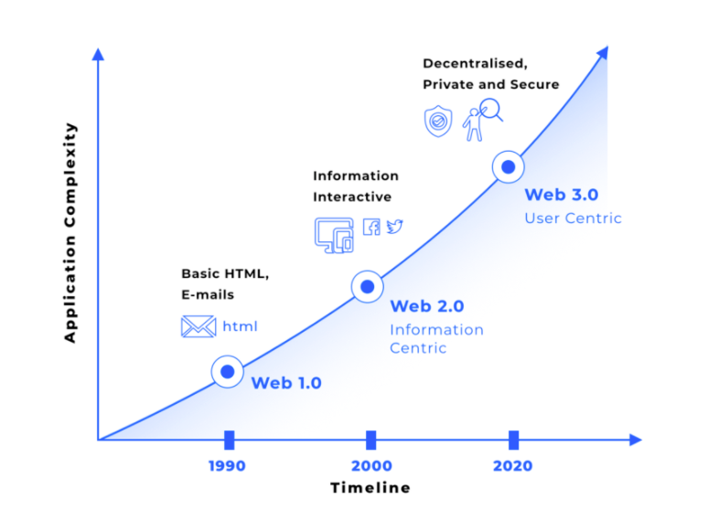
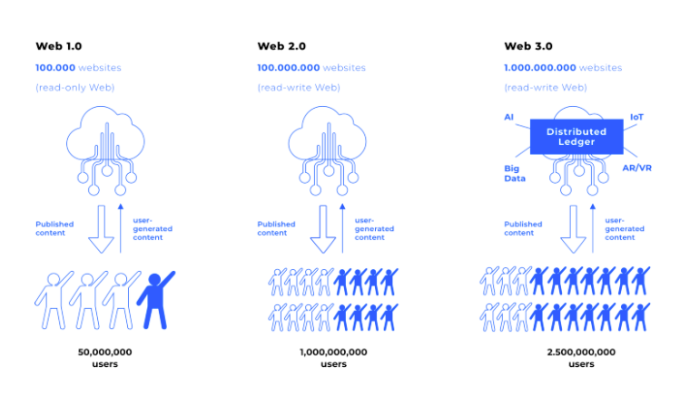
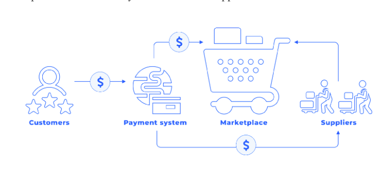

# Web 3.0 on the Waves platform - Coupon Bazaar

Source code and working demo app from the Stepik's Online Learning Course ["Web 3.0 on the Waves platform"](https://stepik.org/course/56401)

"Coupon Bazaar" project demo application version deployed on GitHub Pages: [Coupon Bazaar](https://lytves.github.io/mweb3waves/)

* [Getting Started With Waves Keeper](https://docs.waves.tech/en/ecosystem/waves-keeper/getting-started-with-keeper)


* Project build & run:
```
npm install
npm run build
node server.js
```

* Publishing to GitHub Pages:
```
npm run build
npm run deploy
```

* Web 3.0:




  